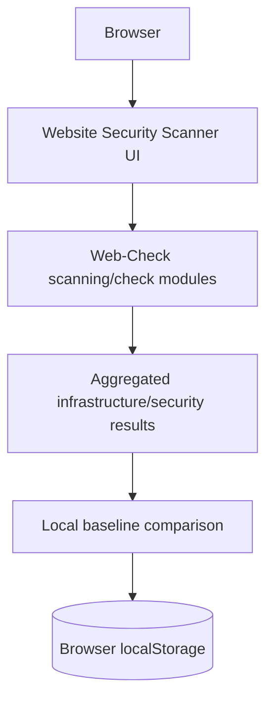

# Website Security Scanner

**Website Security & Infrastructure Intelligence**

Website Security Scanner turns the proven open-source [Web-Check](https://github.com/lissy93/web-check) scanner into a polished, portfolio-ready intelligence console. It preserves Web-Check's scanning architecture and adds a premium responsive interface plus browser-local scan baselines and field-level change detection.

> Website Security Scanner does not claim authorship of Web-Check's scanning engine. The original project was created by Alicia Sykes and is used under the MIT License. See [UPSTREAM.md](./UPSTREAM.md).

## Live Demo

[Open Website Security Scanner](https://website-security-scanner-abhay-f807.vercel.app/check)

## Overview

Enter a hostname and Website Security Scanner runs the existing Web-Check modules in parallel. Results arrive progressively and remain available in their full technical detail. Once a scan settles, it can be saved as a local baseline and compared with a future scan of the same target.

## Features

- DNS, DNSSEC, nameserver, TXT and subdomain intelligence
- SSL certificate, TLS connection, client compatibility and security audit results
- HTTP headers, HSTS, cookies, redirects and HTTP security checks
- Technology, server, port, firewall and network-route detection
- WHOIS, registration, hosting location and domain metadata
- Performance, status, Lighthouse, carbon and page-quality signals
- Threat, blocklist, breach, vulnerability and security.txt checks
- Progressive results, per-check retries, raw JSON export and technical documentation
- Responsive glass interface with reduced-motion support

Availability of individual upstream checks can depend on the target, network access, deployment limits, or optional upstream environment variables. Core operation does not require paid APIs.

## Scan Baselines & Change Detection

After a scan settles, choose **Save as Baseline**. Website Security Scanner stores the resolved result-card data under a versioned key in the browser's `localStorage`. A later successful scan of the same target is compared field by field.

The comparison UI reports:

- **Changed** primitive or structured fields with before and after values
- **Added** fields and array entries
- **Removed** fields and array entries
- **Unchanged** result modules

Array ordering is normalized to avoid false changes. Checks that fail or are skipped in the current run are excluded from comparison, so an unavailable endpoint is never incorrectly reported as removed data. **Reset Baseline** removes the saved snapshot. There is no login, database or baseline API.

## Architecture



The scanner stays in the existing Express/API module layer. Astro serves the application shell and content pages, while React drives scan jobs, progressive results, analysis and baseline comparison. Svelte remains in use for existing icon components.

## Tech Stack

- Astro 7
- React 19 and React Router
- Svelte 5
- Express 5
- TypeScript
- Emotion and Sass
- Framer Motion
- Recharts and React Simple Maps
- Puppeteer, Wappalyzer, Whoiser and the existing Web-Check check modules
- Yarn 1
- Vercel adapter and serverless API routes

## Local Development

Requirements: Node.js 22.22 or newer and Corepack.

```bash
corepack yarn install --frozen-lockfile
corepack yarn dev
```

The interface runs at [http://localhost:4321/check](http://localhost:4321/check) and the local API runs at `http://localhost:3001/api`.

## Production Build

```bash
corepack yarn test
corepack yarn lint
corepack yarn typecheck
corepack yarn build
```

To validate the Vercel target locally:

```bash
PLATFORM=vercel corepack yarn build
```

## Deployment

The repository retains Web-Check's lightweight architecture. For Vercel's function-count limit, a single deployment-only `api/[route].js` catch-all delegates requests to the unchanged scanner handlers in `scanner-api/`; it contains no scanning logic. No database, authentication service or separate backend deployment is required.

```bash
npx vercel --prod
```

Canonical and OpenGraph metadata default to the production URL above. Set `SITE_URL` only when deploying under a different public URL. Optional upstream checks may use the environment variables documented in `.env.sample`; they are not required for the core scanner.

## My Contributions

- Rebranded the product as Website Security Scanner with new navigation, logo, metadata, OpenGraph art and portfolio documentation
- Designed and implemented the responsive glass-style homepage and result presentation
- Built versioned local scan-baseline persistence without adding a backend or account system
- Built the deterministic field-level change engine and its Changed / Added / Removed / Unchanged interface
- Prevented transient failed checks from producing false removal alerts
- Added baseline comparison and persistence tests
- Added reduced-motion behavior, clearer focus states and mobile-specific layout refinements

## Upstream Attribution

Website Security Scanner is based on [Web-Check](https://github.com/lissy93/web-check), created by [Alicia Sykes](https://github.com/lissy93). The exact upstream revision used is:

```text
daa935f174531e04811e99e554ed1ba90c9492cf
```

The original MIT license is preserved in [LICENSE](./LICENSE), and full provenance is recorded in [UPSTREAM.md](./UPSTREAM.md).
