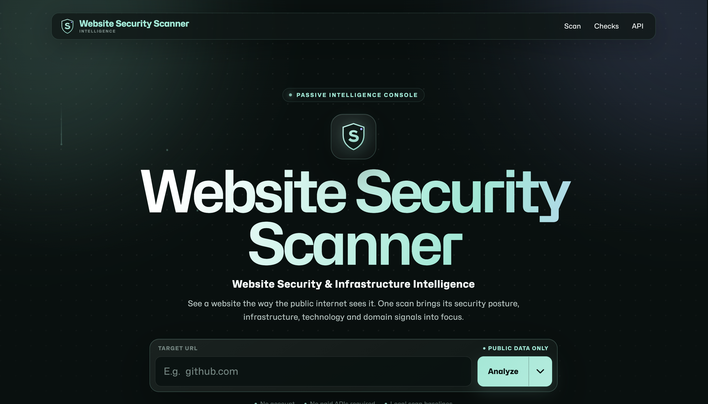
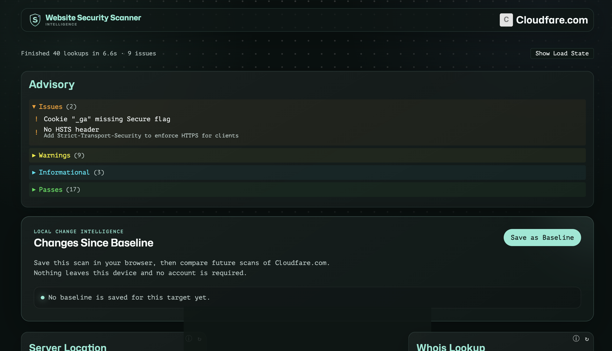
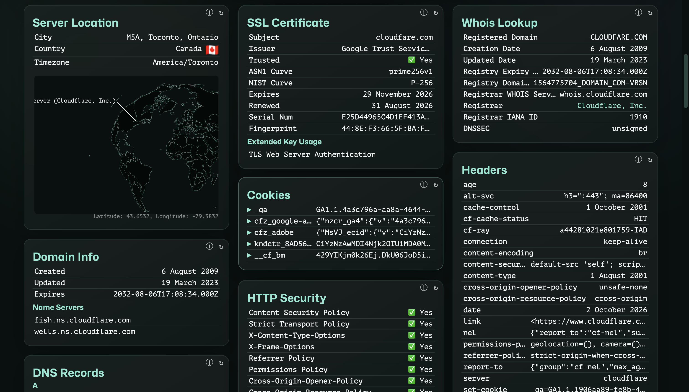
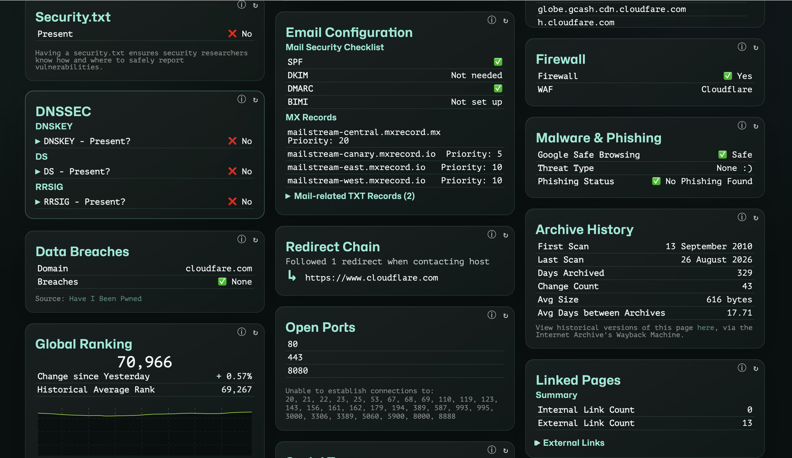
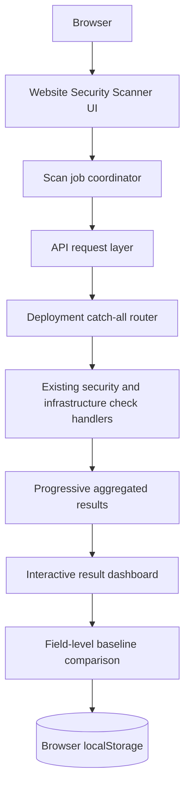

# Website Security Scanner

**Website Security & Infrastructure Intelligence**



Website Security Scanner is a focused intelligence console for understanding the public security posture and infrastructure of a website. It presents progressive results in a polished dashboard and lets you compare future scans against a browser-local baseline.

## Overview

Website Security Scanner analyzes websites across 40 security and infrastructure checks including DNS, DNSSEC, SSL/TLS, HTTP headers, redirects, technologies, domain information, networking, ports, threat signals and related website infrastructure data.

Results appear as they arrive, so useful findings are available before the complete report finishes. The finished report remains fully inspectable, with technical values, expandable details and raw JSON export.

## Features

- 40 website security and infrastructure checks
- DNS and DNSSEC analysis
- SSL/TLS certificate inspection
- HTTP security header analysis
- Domain and WHOIS information
- Network and server information
- Technology detection
- Port information
- Redirect analysis
- Threat/security signals
- Progressive scan results
- Raw result export
- Responsive glass dashboard with reduced-motion support

### Scan Results & Baseline Tracking



Scans surface issues, warnings, informational findings and passes, while browser-local baselines allow later scans to be compared.

### Technical Intelligence Dashboard



The dashboard brings together server location, SSL/TLS certificates, WHOIS and domain information, HTTP security, headers, DNS and related infrastructure signals.

### Advanced Security & Infrastructure Checks



Advanced modules cover DNSSEC, email security configuration, firewall/WAF detection, malware and phishing checks, data breaches, open ports and archive information.

## Baseline & Change Detection

- Save a scan locally in the browser
- Compare later scans
- Detect **Changed / Added / Removed / Unchanged** values
- Field-level comparison of real result data
- No login required
- No database required

Baseline snapshots are stored in browser `localStorage` under a versioned key for each normalized target. Array ordering is normalized to avoid false positives. Checks that fail or are skipped in a later run are excluded from removal reporting, so temporary service failures do not create misleading changes.

## Tech Stack

- React
- TypeScript
- Node.js
- Astro
- Vercel
- Web Security APIs
- Framer Motion
- Sass and Emotion
- Yarn

## Architecture



The browser hosts the interface, scan state and local baseline history. React handles job progress, result presentation and comparison interactions. The Node.js API layer invokes the existing check handlers. On Vercel, one deployment-only catch-all route forwards each public API path to the corresponding handler, keeping the deployment within the platform's function limits without duplicating scanner logic.

## Local Development

Requirements: Node.js 22.22 or newer and Corepack.

```bash
corepack yarn install --frozen-lockfile
corepack yarn dev
```

The development interface runs at [http://localhost:4321/check](http://localhost:4321/check). The local API runs at `http://localhost:3001/api`.

To run the frontend and API separately:

```bash
corepack yarn dev:api
corepack yarn dev:astro
```

## Build

Run the application checks and standard production build:

```bash
corepack yarn test
corepack yarn lint
corepack yarn typecheck
corepack yarn build
```

Build specifically for Vercel with:

```bash
PLATFORM=vercel corepack yarn build
```

## Deployment

The production deployment uses Vercel with the Astro Vercel adapter and the existing Node.js/API architecture. `vercel.json` configures one `api/[route].js` catch-all with a 45-second execution limit. That route only resolves the requested path and forwards it to the existing handler; it does not implement scanning logic.

Deploy from the repository with:

```bash
npx vercel --prod
```

The application requires no authentication service, database or paid API for core operation. Optional third-party credentials can be supplied through environment variables when additional checks need them.

## Live Demo

[https://website-security-scanner-abhay-f807.vercel.app/check](https://website-security-scanner-abhay-f807.vercel.app/check)

## GitHub

[https://github.com/abhayjavaregowda/website-security-scanner](https://github.com/abhayjavaregowda/website-security-scanner)

## Key Engineering Work

- Browser-local baseline persistence with versioned target storage
- Deterministic field-level change detection
- Comparison UI for Changed, Added, Removed and Unchanged values
- Responsive dashboard redesign with accessible motion and mobile layouts
- Progressive scan presentation as checks complete
- Deployment-only Vercel catch-all routing adapter
- Production deployment and public runtime verification
